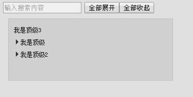

# js-tree
js树状折叠插件,主要实现树状结构的展示效果，附加搜索功能.如下图demo效果，样式可以自定义。



# npm 
    install --save js-tree-search

# 如何使用
```javascript
let jsTree = new JsTree($('#container'));
let data = [
    {
        "id": 9,
        "parentId": 0,
        "text": "我是顶级3"
    },
    {
        "id": 1,
        "parentId": 0,
        "text": "我是顶级",
        "child": [
            {
                "id": 2,
                "parentId": 1,
                "text": "我是一级",
                "child": [
                    {
                        "id": 3,
                        "parentId": 2,
                        "text": "我是二级",
                        "child": [
                            {
                                "id": 5,
                                "parentId": 3,
                                "text": "我是二一级"
                            }
                        ]
                    }
                ]
            }
        ]
    },
    {
        "id": 6,
        "parentId": 0,
        "text": "我是顶级2",
        "child": [
            {
                "id": 4,
                "parentId": 6,
                "text": "我是一一级"
            }
        ]
    }
]
jsTree.init({ data: data, searchInput:$('#txt_seach'), childrenField: "child", value: "id", text: "text" ,clickCallback:(e)=>{
    console.log(e)
}});
$('#openAll').click(function(){
    jsTree.openAll();
})
$('#closeAll').click(function(){
    jsTree.closeAll();
})
```
这里的数据是树状结构的，如果你的结构是扁平的，可以使用插件[datatotree](https://github.com/tianxiangbing/data-tree "datatotree")进行转换：
```js
let d3 = [
    { id: 1, parentId: 0, text: "我是顶级" },
    { id: 6, parentId: 0, text: "我是顶级2" },
    { id: 2, parentId: 1, text: "我是一级" },
    { id: 3, parentId: 2, text: "我是二级" },
    { id: 4, parentId: 6, text: "我是一一级" },
    { id: 5, parentId: 3, text: "我是二一级" }
];
let res = DataTree.convert({ data: d3, parentField: "parentId", topValue: 0, keyId: "id" });
console.log(JSON.stringify(res))
/*
[
    {
        "id": 1,
        "parentId": 0,
        "text": "我是顶级",
        "child": [
            {
                "id": 2,
                "parentId": 1,
                "text": "我是一级",
                "child": [
                    {
                        "id": 3,
                        "parentId": 2,
                        "text": "我是二级",
                        "child": [
                            {
                                "id": 5,
                                "parentId": 3,
                                "text": "我是二一级"
                            }
                        ]
                    }
                ]
            }
        ]
    },
    {
        "id": 6,
        "parentId": 0,
        "text": "我是顶级2",
        "child": [
            {
                "id": 4,
                "parentId": 6,
                "text": "我是一一级"
            }
        ]
    }
]
*/
```
# API
# init参数
## constructor构造方法:`function(container)`
    传入显示树的容器
## init 
    初始化插件的方法,需要传递下面的参数
## data: data
    树形数据，如果需要转换可以使用datatotree进行转换,必填
## searchInput:dom||undefined
    如果需要搜索功能可以加这个参数，否则无搜索
## childrenField: [string]
    树状子结点的属性名称，例子中的 child,默认值 children
## value: "id"
    绑在结点上的值，可以在选中此结点的回调中拿取
## text: "text" 
    显示结点的title
## isRowHandle:bool
    默认为false,是否需要通过点行来展开
## clickCallback:(li)
    点击当前结点的回调,参数为当前结点的html结构，这里生成的结构为li
## formatItem:(item,data)
    需要特殊格式化结点的html结构时，可以在这里返回结果，item为当前结点的完整数据
## openCallback
    展开时的回调
## closeCallback
    收起时的回调
# 方法
## openAll
    展开所有结点
## closeAll
    收起所有结点
